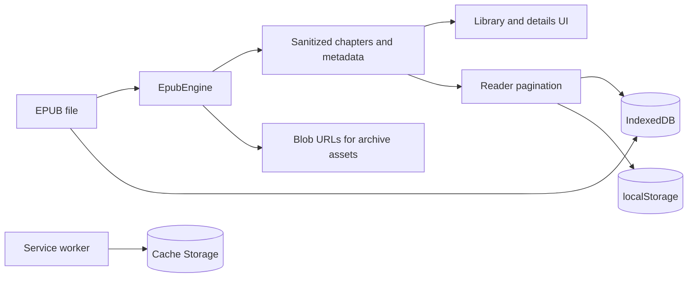
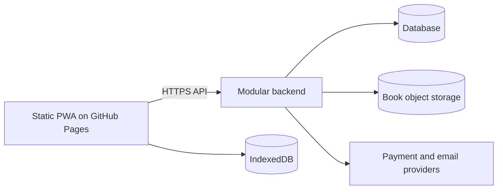

# Architecture

## Current system

Granthalay is currently a fully client-side static SvelteKit application.

## Main areas

- `src/routes/+page.svelte`: library loading, import, view, theme, and install prompt.
- `src/routes/annotations/+page.svelte`: responsive library-wide bookmark and highlight management.
- `src/routes/settings/+page.svelte`: responsive global reading defaults and local-privacy guidance.
- `src/routes/book/[bookId]/+page.svelte`: metadata, chapters, and start/resume links.
- `src/routes/reader/+page.svelte`: measurement, pagination, navigation, and progress.
- `src/lib/epub/engine.ts`: ZIP, container/OPF/TOC/CSS, resources, sanitization, and chapters.
- `src/lib/db.ts`: native IndexedDB boundary.
- `src/lib/backup.ts`: versioned backup creation, validation, conflict preview, and restoration.
- `src/service-worker.ts`: application caching and navigation fallback.

On import, the engine runs in metadata-only mode, then metadata and raw bytes are committed to
separate stores. Opening and reading a book perform a full parse. The reader measures chapters in
an off-screen element and selects a layout heuristically. It persists the chapter plus a normalized
position within that chapter, alongside page/global progress for display and backward compatibility,
so repagination can restore the nearest reading position instead of reusing a stale page number.
Bookmarks and highlights use a versioned portable annotation record in IndexedDB. Locations identify
the EPUB spine href and a normalized progression rather than a rendered page number; highlights also
carry an exact text quote with optional surrounding context so a later renderer can re-anchor them
after ordinary typography and viewport changes.
Global reader defaults use a versioned local-storage record. Per-book overrides use keys derived from
the book ID and fall back to that global record when absent. Values are validated and bounded before
use; changes trigger semantic repagination, while typography overrides are limited to detected
reflowable text chapters.
Library restore treats archive contents as untrusted. It validates the versioned manifest, safe paths,
bounded fields and payloads, EPUB signatures, and book/annotation relationships before presenting a
conflict preview. Selected metadata, EPUB bytes, and annotations share one read-write IndexedDB
transaction; local preference values are snapshotted and reverted if that transaction aborts.
New exports wrap the entire ZIP payload in a versioned authenticated-encryption envelope. A
passphrase-derived AES-256-GCM key encrypts the ZIP; the envelope header is authenticated as additional
data. Decryption completes before ZIP parsing, so incorrect passphrases and modified envelopes never
reach the restore preview or database boundary.

Storage health uses capability-detected StorageManager estimates and Cache Storage inspection. The
service worker separates the versioned offline application shell from runtime responses so Settings
can clear temporary cache entries without deleting offline-critical assets. Multi-book deletion uses
one IndexedDB transaction across metadata, EPUB content, and annotations.

The engine follows `META-INF/container.xml` to the package document, maps manifest and spine,
loads EPUB 3 navigation or EPUB 2 NCX labels, extracts/scopes CSS, and converts archive resource
references to object URLs. HTML is sanitized before Svelte renders it.

Imported content cannot initiate network requests. The engine removes remote, absolute, missing,
and imported blob references from markup and styles; it strips CSS imports and image sets. Packaged
images and CSS resources are mediated through engine-owned blob URLs, which are revoked when the
engine is destroyed. Data URLs are limited to image elements, while scripts, frames, forms, and
external links do not cross the sanitizer boundary. Package-internal anchors are canonicalized to
chapter paths, retained as inert data attributes, and handled by the reader without a network
navigation.

SvelteKit uses `adapter-static` with a `404.html` fallback. The base path is `/Granthalay` only when
`DEPLOY_TARGET=github-pages`; other builds use `/`. See [Deployment](06-deployment.md).

## Target system

One repository will produce two independently deployed artifacts:

The PWA owns Reader and local Library behavior. It remains useful without the API and keeps personal
books and progress on-device. The separately hosted backend owns Accounts, Catalog, Content,
Commerce, Entitlements, Notification, Publisher, Administration, and Audit modules.

The backend starts as one deployable and database. Each module owns its data and communicates
through explicit internal APIs or events; external providers stay behind adapters. The PWA uses a
versioned HTTPS API with an explicit GitHub Pages CORS origin. Email/password authentication uses
short-lived JWT access tokens and a revocable refresh/session mechanism. Purchased files are
delivered only after entitlement checks, never bundled into the static site. Backend modules split
into services only when operational evidence justifies it.

Zod validates shared contracts and untrusted input at runtime. Pino provides structured backend
logs with field redaction. Sentry is an optional diagnostics adapter for both deployables, disabled
unless configured and supplied only scrubbed errors. Installing these packages does not enable
logging or telemetry by itself.
