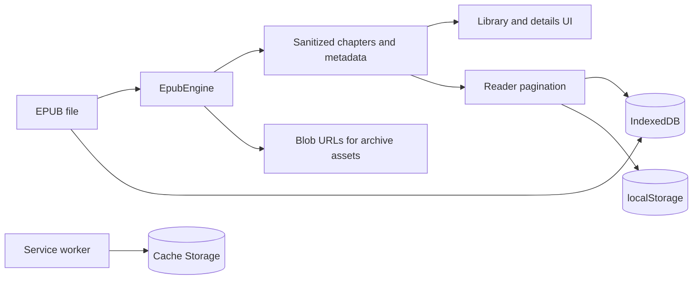

# Architecture

## Current system

Granthalay is currently a fully client-side static SvelteKit application.

## Main areas

- `src/routes/+page.svelte`: library loading, import, view, theme, and install prompt.
- `src/routes/book/[bookId]/+page.svelte`: metadata, chapters, and start/resume links.
- `src/routes/reader/+page.svelte`: measurement, pagination, navigation, and progress.
- `src/lib/epub/engine.ts`: ZIP, container/OPF/TOC/CSS, resources, sanitization, and chapters.
- `src/lib/db.ts`: native IndexedDB boundary.
- `src/service-worker.ts`: application caching and navigation fallback.

On import, the engine runs in metadata-only mode, then metadata and raw bytes are committed to
separate stores. Opening and reading a book perform a full parse. The reader measures chapters in
an off-screen element, selects a layout heuristically, and persists chapter/page/global progress.

The engine follows `META-INF/container.xml` to the package document, maps manifest and spine,
loads EPUB 3 navigation or EPUB 2 NCX labels, extracts/scopes CSS, and converts archive resource
references to object URLs. HTML is sanitized before Svelte renders it.

SvelteKit uses `adapter-static` with a `404.html` fallback. The base path is `/Granthalay` only when
`DEPLOY_TARGET=github-pages`; other builds use `/`. See [Deployment](06-deployment.md).

## Target system

The repository will evolve into one modular monolith with Reader, Library, Identity, Catalog,
Content, Commerce, Entitlements, Notification, Publisher, Administration, and Audit modules. It
starts as one deployable application and database; each module owns its tables and communicates
through explicit APIs or in-process events. External providers stay behind adapters. Services are
split only when operational evidence justifies it.
