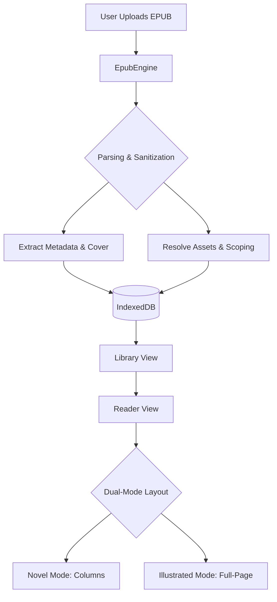

# Architecture Specification

## Overview
The Samster Reader is a modern, client-side EPUB reader built with SvelteKit. It prioritizes speed, privacy, and a clean reading experience by performing all parsing and data storage locally in the user's browser.

## Core Technologies
- **Framework**: [SvelteKit](https://kit.svelte.dev/) (using Svelte 5 Runes)
- **Styling**: Vanilla CSS with [Tailwind CSS Typography](https://tailwindcss.com/docs/typography-plugin) for book content.
- **Parsing**: [JSZip](https://stuk.github.io/jszip/) for EPUB extraction and [sanitize-html](https://www.npmjs.com/package/sanitize-html) for security.
- **Database**: [Dexie.js](https://dexie.org/) (IndexedDB) for local book storage.
- **Icons**: [Lucide Svelte](https://lucide.dev/guide/svelte)

## Key Components

### 1. EpubEngine (`src/lib/epub/engine.ts`)
The "Brain" of the application. It handles:
- **Anchored Parsing**: Balances physical file separation (for performance and page-per-image rendering) with logical grouping based on TOC anchors.
- **High-Fidelity Resolution**: Resolves SVG `xlink:href`, `viewBox`, and internal CSS references into local Blob URLs.
- **Asset Scoping**: Dynamically scopes book-specific CSS to the `.epub-content` namespace.
- **Intelligent Metadata**: Heuristic-based cover extraction and frontmatter identification.

### 2. Database Layer (`src/lib/db.ts`)
Manages the local library using IndexedDB.
- **Books**: Stores the original EPUB `ArrayBuffer`, cover data, and metadata.
- **Progress**: Tracks the user's last read chapter and page for each book.

### 3. Reader Logic (`src/routes/reader/+page.svelte`)
A hybrid layout engine that:
- **Dual-Mode Layout**: Toggles between a multi-column "Novel Mode" and a centered "Illustrated Mode" based on book structure.
- **Background Pagination**: Calculates total book pages in a background worker/DOM-div to provide global progress (e.g. "Page 42 of 223") without blocking the UI.
- **Navigation Engine**: Handles horizontal transforms for page flipping with snap-to-page physics.
- **Dark Mode Engine**: Forces color inheritance across deep DOM structures in book content.

## Design Patterns
- **Service-Oriented**: Heavy logic is isolated in the `EpubEngine` service.
- **Component-Driven**: UI elements like `BookCard` are isolated for reusability.
- **Local-First**: All data stays in the browser; no cloud sync is required for core functionality.
