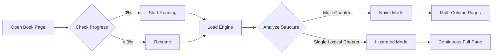

# Feature Specification

## 1. Library Management
- **File Support**: Supports standard `.epub` files.
- **Local Upload**: Users can drag and drop or select files to add to their library.
- **Automatic Metadata**: The system automatically extracts titles and covers for the library view.
- **Persistence**: Books are stored in IndexedDB, surviving page reloads and browser restarts.

## 2. Reading Experience
- **Dual-Mode Layout**:
  - **Novel Mode**: Uses multi-column CSS layout for standard text-heavy books.
  - **Illustrated Mode**: Disables columns for "Fit-to-Screen" rendering of drawings and covers (e.g. Diary of a Wimpy Kid).
- **High-Fidelity Rendering**: Preserves SVG `viewBox` and `preserveAspectRatio` attributes to ensure illustrations scale correctly.
- **Fluid Layout**: Adapts column width and font sizes for mobile, tablet, and desktop.
- **Chapter Navigation**: Supports jumping between chapters via a Table of Contents (TOC).
- **Navigation Gestures**:
  - **Click/Tap**: Click the right 30% of the screen for next, left 30% for previous.
  - **Swipe**: Natural touch gestures for page flipping on mobile devices.
  - **Keyboard**: Arrow keys and Spacebar support.

## 3. Customization
- **Dark Mode**: High-contrast dark theme that also forces internal EPUB content to respect user preferences.
- **Dynamic CSS Scoping**: Ensures book-specific styles don't conflict with the app's UI.

## 4. Progress Tracking
- **Global Percentage**: Tracks progress across the entire book, not just the current chapter.
- **Intelligent Start/Resume**: 
  - **Start Reading**: Defaults to page 1 (or cover) for new books (0% progress).
  - **Resume**: Restores the exact chapter and page for books with >0% progress.
- **Visual Feedback**:
  - Percentage badges on library cards.
  - Progress bar and continuous page count (e.g. "Page 15 of 223") in Illustrated Mode.
- **Auto-Persistence**: Saves position in real-time to IndexedDB.

## 5. PWA (Progressive Web App)
- **Installable**: Can be installed on mobile and desktop via standard PWA prompts.
- **Offline Ready**: Core reader functionality works without an internet connection once books are loaded.
